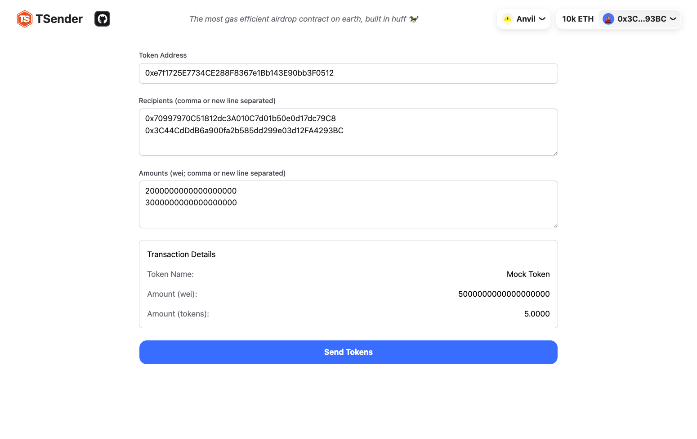

# Token Sender DApp

A 100% client-side UI for the TSender contract, allowing users to easily airdrop ERC20 tokens to multiple recipients in a single transaction.

Smart Contracts: https://github.com/Cyfrin/TSender/

Live Demo: https://ts-tsender-ui.vercel.app/



- [Token Sender DApp](#token-sender-dapp)
- [Features](#features)
- [Tech Stack](#tech-stack)
- [Supported Networks](#supported-networks)
- [Getting Started](#getting-started)
  - [Requirements](#requirements)
  - [Environment Variables](#environment-variables)
  - [Setup](#setup)
- [Testing](#testing)
  - [Unit](#unit)
  - [e2e](#e2e)
- [Contributing](#contributing)
- [License](#license)

## Features

- Connect with your Web3 wallet (via RainbowKit)
- Select any ERC20 token from supported networks
- Bulk send tokens to multiple addresses in one transaction
- Automatic token approval handling
- Multi-chain support

## Tech Stack

- **Frontend**:

  - [Next.js](https://nextjs.org/) (v15.3.2)
  - [React](https://reactjs.org/) (v19.0.0)
  - [TailwindCSS](https://tailwindcss.com/) (v4)
  - [TypeScript](https://www.typescriptlang.org/)

- **Web3 Integration**:

  - [RainbowKit](https://www.rainbowkit.com/) - Wallet connection UI
  - [Wagmi](https://wagmi.sh/) - React hooks for Ethereum
  - [Viem](https://viem.sh/) - TypeScript interface to Ethereum

- **Testing**:

  - [Vitest](https://vitest.dev/) - Unit testing
  - [Playwright](https://playwright.dev/) - E2E testing
  - [Synpress](https://github.com/synthetixio/synpress) - Web3 E2E testing

- **Development Tools**:
  - [Anvil](https://github.com/foundry-rs/foundry/tree/master/anvil) - Local Ethereum node

## Supported Networks

The application supports multiple networks, including:

- Ethereum Mainnet
- ZKSync
- Arbitrum
- Optimism
- Base
- Anvil (Local Testing)
- Ethereum Sepolia (Testnet)

## Getting Started

### Requirements

- [node](https://nodejs.org/en/download)
  - You'll know you've installed it right if you can run `node --version` and get a response like `v23.0.1`
- [pnpm](https://pnpm.io/)
  - You'll know you've installed it right if you can run `pnpm --version` and get a response like `10.1.0`
- [git](https://git-scm.com/downloads)
  - You'll know you've installed it right if you can run `git --version` and get a response like `git version 2.33.0`
- [Foundry](https://book.getfoundry.sh/getting-started/installation) (for local development with Anvil)
  - You'll know you've installed it right if you can run `anvil --version`

### Environment Variables

You'll need a `.env.local` file with the following environment variables:

- `NEXT_PUBLIC_WALLETCONNECT_PROJECT_ID`: Project ID from [WalletConnect Cloud](https://cloud.walletconnect.com/)

### Setup

```bash
git clone https://github.com/Molina-Daniel/ts-tsender-ui.git
cd ts-tsender-ui
pnpm install
```

For local development with Anvil:

```bash
pnpm anvil
```

You'll want to make sure you have a Metamask/Rabby wallet connected to your Anvil instance. Ideally, connect to the wallet that comes with the default Anvil instance. This wallet will have some mock tokens in it.

Then, in a second terminal window run:

```bash
pnpm dev
```

The application should now be running at http://localhost:3000.

### Testing

## Unit

Run the unit tests with:

```bash
pnpm test:unit
```

This will test utility functions like `calculateTotal` and `formatWei`.

## e2e

Playwright should automatically install the browsers needed to run tests.

To prepare for e2e testing, first run:

```bash
pnpm test:cache
```

This may throw an error like:

```
Error: Cache for 08a20e3c7fc77e6ae298 does not exist. Create it first!
```

The `08a20e3c7fc77e6ae298` is your `CACHE_NAME`.

In your `.cache-synpress` folder, rename the folder that isn't `metamask-chrome-***` to your `CACHE_NAME`.

Then, you should be able to run:

```bash
pnpm test:e2e
```

You are all set. Enjoy coding!
